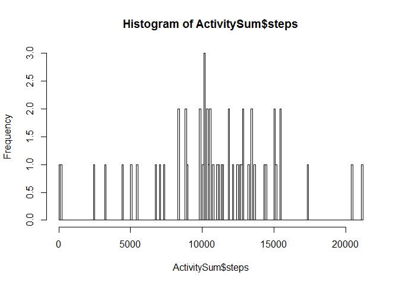
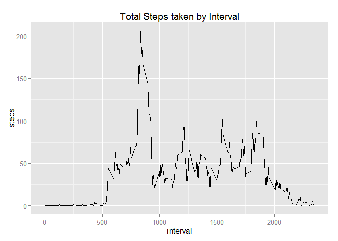
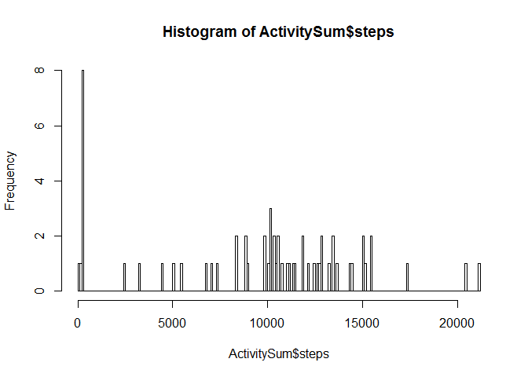
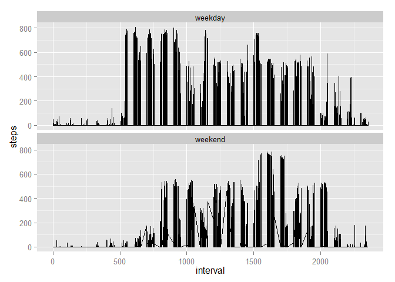

# Reproducible Research: Peer Assessment 1
Ben Holcombe  
Sunday, April 19, 2015  

## Loading and preprocessing the data
- We begin by downloading the [repdata_data_activity.zip][1] file.  
[1]: http://d396qusza40orc.cloudfront.net/repdata%2Fdata%2Factivity.zip [repdata_data_activity.zip]
- Once downloaded we unzipping the file.

```r
fileURL <- "http://d396qusza40orc.cloudfront.net/repdata%2Fdata%2Factivity.zip"
download.file(fileURL, destfile = "./activity.zip")
unzip("activity.zip")
```

- Next the file is loaded into a data frame and the date column is converted from a factor class into a date class.

```r
ActivityData <- read.csv("activity.csv")
ActivityData$date <- as.Date(ActivityData$date)
```

## What is mean total number of steps taken per day?
- Calculate the total steps for each day.

```r
ActivitySum <- aggregate(steps ~ date, FUN = sum, data = ActivityData)
colnames(ActivitySum)[2] <- "steps.total"
```
- Display a histogram of the total number of steps per day.

```r
hist(ActivitySum$steps, breaks = 288)
```

 

- Calculate the Mean and Median steps for each day.

```r
ActivityMean <- aggregate(steps ~ date, FUN = mean, data = ActivityData)
colnames(ActivityMean)[2] <- "steps.mean"
ActivityMedian <- aggregate(steps ~ date, FUN = median, data = ActivityData)
colnames(ActivityMedian)[2] <- "steps.median"
ActivitySummary <- cbind(ActivitySum, steps.mean = ActivityMean$steps.mean, steps.median = ActivityMedian$steps.median)
```

The Mean, Median, and Total steps taken per day.

```r
ActivitySummary
```

```
##          date steps.total steps.mean steps.median
## 1  2012-10-02         126  0.4375000            0
## 2  2012-10-03       11352 39.4166667            0
## 3  2012-10-04       12116 42.0694444            0
## 4  2012-10-05       13294 46.1597222            0
## 5  2012-10-06       15420 53.5416667            0
## 6  2012-10-07       11015 38.2465278            0
## 7  2012-10-09       12811 44.4826389            0
## 8  2012-10-10        9900 34.3750000            0
## 9  2012-10-11       10304 35.7777778            0
## 10 2012-10-12       17382 60.3541667            0
## 11 2012-10-13       12426 43.1458333            0
## 12 2012-10-14       15098 52.4236111            0
## 13 2012-10-15       10139 35.2048611            0
## 14 2012-10-16       15084 52.3750000            0
## 15 2012-10-17       13452 46.7083333            0
## 16 2012-10-18       10056 34.9166667            0
## 17 2012-10-19       11829 41.0729167            0
## 18 2012-10-20       10395 36.0937500            0
## 19 2012-10-21        8821 30.6284722            0
## 20 2012-10-22       13460 46.7361111            0
## 21 2012-10-23        8918 30.9652778            0
## 22 2012-10-24        8355 29.0104167            0
## 23 2012-10-25        2492  8.6527778            0
## 24 2012-10-26        6778 23.5347222            0
## 25 2012-10-27       10119 35.1354167            0
## 26 2012-10-28       11458 39.7847222            0
## 27 2012-10-29        5018 17.4236111            0
## 28 2012-10-30        9819 34.0937500            0
## 29 2012-10-31       15414 53.5208333            0
## 30 2012-11-02       10600 36.8055556            0
## 31 2012-11-03       10571 36.7048611            0
## 32 2012-11-05       10439 36.2465278            0
## 33 2012-11-06        8334 28.9375000            0
## 34 2012-11-07       12883 44.7326389            0
## 35 2012-11-08        3219 11.1770833            0
## 36 2012-11-11       12608 43.7777778            0
## 37 2012-11-12       10765 37.3784722            0
## 38 2012-11-13        7336 25.4722222            0
## 39 2012-11-15          41  0.1423611            0
## 40 2012-11-16        5441 18.8923611            0
## 41 2012-11-17       14339 49.7881944            0
## 42 2012-11-18       15110 52.4652778            0
## 43 2012-11-19        8841 30.6979167            0
## 44 2012-11-20        4472 15.5277778            0
## 45 2012-11-21       12787 44.3993056            0
## 46 2012-11-22       20427 70.9270833            0
## 47 2012-11-23       21194 73.5902778            0
## 48 2012-11-24       14478 50.2708333            0
## 49 2012-11-25       11834 41.0902778            0
## 50 2012-11-26       11162 38.7569444            0
## 51 2012-11-27       13646 47.3819444            0
## 52 2012-11-28       10183 35.3576389            0
## 53 2012-11-29        7047 24.4687500            0
```
## What is the average daily activity pattern?
- Calculate the total steps for each interval.

```r
ActivityIntervalSum <- aggregate(steps ~ interval, FUN = sum, data = ActivityData)
```
- Below is the total steps taken by interval.  This graph shows a peak early on.  

```r
ActivityIntervalAvg <- aggregate(steps ~ interval, FUN = mean, data = ActivityData)
library(ggplot2)
ChartTitle <- "Total Steps taken by Interval"
ggplot(data = ActivityIntervalAvg, aes(interval, steps)) + geom_line() + labs(title = ChartTitle)
```

 

- Calculating the peak interval.

```r
PeakInterval <- ActivityIntervalSum[order(-ActivityIntervalSum["steps"]),]
PeakInterval[1,]
```

```
##     interval steps
## 104      835 10927
```

```r
pinterval <- PeakInterval[1,1]
psteps <- PeakInterval[1,2]
```

- The peak interval is 835 with a total of 10927 steps taken.

## Imputing missing values

```r
ActivityDataMissing <- is.na(ActivityData$steps)
missing <- as.character(t(ActivityDataMissing) %*% ActivityDataMissing)
```
- The total number of missing values is 2304.

- When we substitute 1 for the missing values we have the following results.

```r
ActivityData[is.na(ActivityData)] <- 1
```


```r
ActivitySum <- aggregate(steps ~ date, FUN = sum, data = ActivityData)
colnames(ActivitySum)[2] <- "steps.total"
```
- Display a histogram of the total number of steps per day.

```r
hist(ActivitySum$steps, breaks = 288)
```

 

- Calculate the Mean and Median steps for each day.

```r
ActivityMean <- aggregate(steps ~ date, FUN = mean, data = ActivityData)
colnames(ActivityMean)[2] <- "steps.mean"
ActivityMedian <- aggregate(steps ~ date, FUN = median, data = ActivityData)
colnames(ActivityMedian)[2] <- "steps.median"
ActivitySummary <- cbind(ActivitySum, steps.mean = ActivityMean$steps.mean, steps.median = ActivityMedian$steps.median)
```

The Mean, Median, and Total steps taken per day.

```r
ActivitySummary
```

```
##          date steps.total steps.mean steps.median
## 1  2012-10-01         288  1.0000000            1
## 2  2012-10-02         126  0.4375000            0
## 3  2012-10-03       11352 39.4166667            0
## 4  2012-10-04       12116 42.0694444            0
## 5  2012-10-05       13294 46.1597222            0
## 6  2012-10-06       15420 53.5416667            0
## 7  2012-10-07       11015 38.2465278            0
## 8  2012-10-08         288  1.0000000            1
## 9  2012-10-09       12811 44.4826389            0
## 10 2012-10-10        9900 34.3750000            0
## 11 2012-10-11       10304 35.7777778            0
## 12 2012-10-12       17382 60.3541667            0
## 13 2012-10-13       12426 43.1458333            0
## 14 2012-10-14       15098 52.4236111            0
## 15 2012-10-15       10139 35.2048611            0
## 16 2012-10-16       15084 52.3750000            0
## 17 2012-10-17       13452 46.7083333            0
## 18 2012-10-18       10056 34.9166667            0
## 19 2012-10-19       11829 41.0729167            0
## 20 2012-10-20       10395 36.0937500            0
## 21 2012-10-21        8821 30.6284722            0
## 22 2012-10-22       13460 46.7361111            0
## 23 2012-10-23        8918 30.9652778            0
## 24 2012-10-24        8355 29.0104167            0
## 25 2012-10-25        2492  8.6527778            0
## 26 2012-10-26        6778 23.5347222            0
## 27 2012-10-27       10119 35.1354167            0
## 28 2012-10-28       11458 39.7847222            0
## 29 2012-10-29        5018 17.4236111            0
## 30 2012-10-30        9819 34.0937500            0
## 31 2012-10-31       15414 53.5208333            0
## 32 2012-11-01         288  1.0000000            1
## 33 2012-11-02       10600 36.8055556            0
## 34 2012-11-03       10571 36.7048611            0
## 35 2012-11-04         288  1.0000000            1
## 36 2012-11-05       10439 36.2465278            0
## 37 2012-11-06        8334 28.9375000            0
## 38 2012-11-07       12883 44.7326389            0
## 39 2012-11-08        3219 11.1770833            0
## 40 2012-11-09         288  1.0000000            1
## 41 2012-11-10         288  1.0000000            1
## 42 2012-11-11       12608 43.7777778            0
## 43 2012-11-12       10765 37.3784722            0
## 44 2012-11-13        7336 25.4722222            0
## 45 2012-11-14         288  1.0000000            1
## 46 2012-11-15          41  0.1423611            0
## 47 2012-11-16        5441 18.8923611            0
## 48 2012-11-17       14339 49.7881944            0
## 49 2012-11-18       15110 52.4652778            0
## 50 2012-11-19        8841 30.6979167            0
## 51 2012-11-20        4472 15.5277778            0
## 52 2012-11-21       12787 44.3993056            0
## 53 2012-11-22       20427 70.9270833            0
## 54 2012-11-23       21194 73.5902778            0
## 55 2012-11-24       14478 50.2708333            0
## 56 2012-11-25       11834 41.0902778            0
## 57 2012-11-26       11162 38.7569444            0
## 58 2012-11-27       13646 47.3819444            0
## 59 2012-11-28       10183 35.3576389            0
## 60 2012-11-29        7047 24.4687500            0
## 61 2012-11-30         288  1.0000000            1
```

Since this is a very simple substitution of values you see the histogram shift where the missing values are represented in the 0 - 5000 range.  

## Are there differences in activity patterns between weekdays and weekends?

```r
ActivityData$day <- weekdays(ActivityData$date)
ActivityData$week.part <- sapply(ActivityData$day, switch,
    Saturday = "weekend",
    Sunday = "weekend",
    Monday = "weekday",
    Tuesday = "weekday",
    Wednesday = "weekday",
    Thursday = "weekday",
    Friday = "weekday",
  )

ggplot(data = ActivityData, aes(x=interval, y=steps)) + geom_line() + facet_wrap( ~ week.part, ncol=1)
```

 
